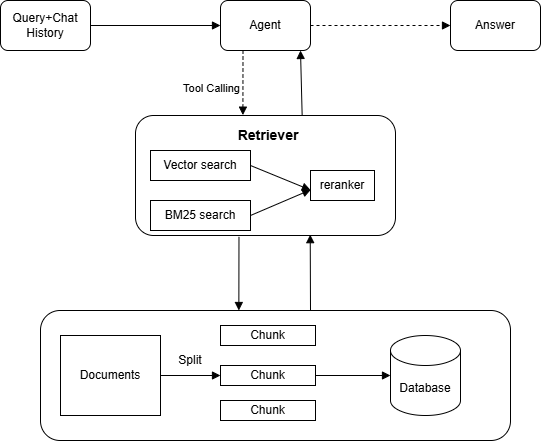
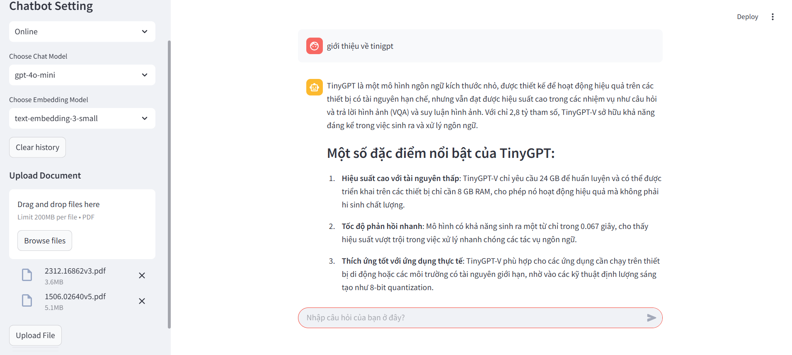

# Agent-RAG
## 📖 Introduction 
Agent-RAG is a chatbot project that allows users to upload PDF documents and ask questions about them through a chatbot interface. The system uses RAG and advanced techniques to provide the most accurate answers.

**Chatbot processing flow**




## ⭐ Features

- Easy to run locally and online API  
- Supports uploading one or multiple PDF files  
- Combines multiple retrieval and re-ranking methods  
- User-friendly interface built with Streamlit  
  


## 📋 System Requirements
- Requires Python version 3.9 or higher
- Ollama is used to run the chatbot locally ([Download](https://ollama.com/download))
- OpenAI API key is used to run the chatbot through API([Register](https://platform.openai.com/api-keys))
- The Langchain API key is used for tracing and debugging the LLM ([Register](https://smith.langchain.com/))

## ⬇️ Installation instructions
### 🔹 1. Clone the repository

```bash
git clone https://github.com/tuanbeba/Agent-Rag
cd Agent-Rag
```

### 🔹 2. Install dependencies

```bash
pip install -r requirements.txt
```

### 🔹 3. Set up environment variables

Create a `.env` file in the project root and add the required configuration values:

```bash
#OpenAI API key
OPENAI_API_KEY= <Your API key>

#Lang Smith
LANGCHAIN_TRACING_V2=true
LANGCHAIN_ENDPOINT="https://api.smith.langchain.com"
LANGCHAIN_API_KEY=<Your langchain API key>
LANGCHAIN_PROJECT=<Your project name>
```

### 🔹 4. Run the application

```bash
streamlit run src/main.py
```

## 📌 Usage
### User Interface  

### 🔹 1. Start App
You can view the application at Local URL: `http://localhost:8501`
### 🔹 2. Choosing model
If you choose the online option, the system will use OpenAI's chat model and embedding model. If you choose the local option, it will use Ollama's chat model and embedding model. You can read more in the Ollama documentation [here](https://ollama.com/search) and the OpenAI documentation [here](https://platform.openai.com/docs/models).

If you want to add more models, please check [here](#-configuration).

### 🔹 3. Upload document

Upload one or more PDF documents that you want to query.

Click the `Upload File` button to save your document to the database. If the file is uploaded successfully, the message `Files uploaded successfully!` will be displayed.

### 🔹 4. Send question

Type your question and press **Enter** to submit.

## 🔑 Configuration

You can customize various parameters of the system in the `settings.py` and `option_model.py` files.

If you want to add more models **modify** `option_model.py` 

If you want to change the number of documents retrieved, use rerank or not, **modify** `settings.py` 


## 📂 Project Structure

```
├──README.md
├──requirement.txt
├──chroma_test        
├──image
└──src
│   ├───agent.py
│   ├───main.py
│   ├───options_model.py
│   ├───setting.py
│   └───vectorstore.py
```

## 📚 References
- [LangChain](https://python.langchain.com/docs/how_to/)
- [Streamlit]( https://docs.streamlit.io/)
- [Cohere](https://docs.cohere.com/page/agentic-rag-mixed-data#sec_step3)

